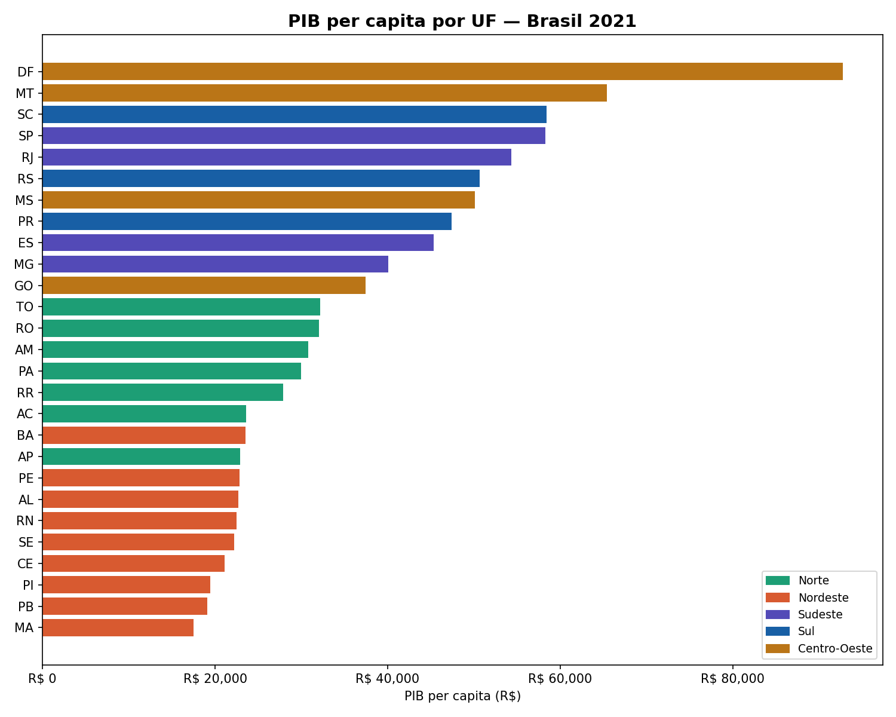
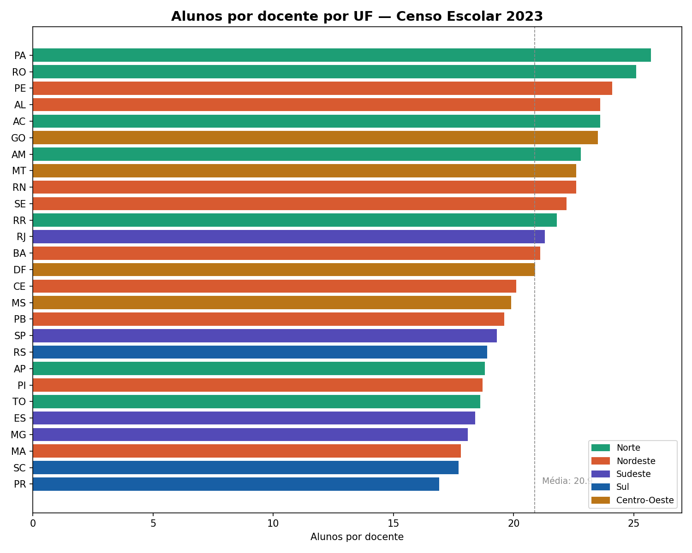
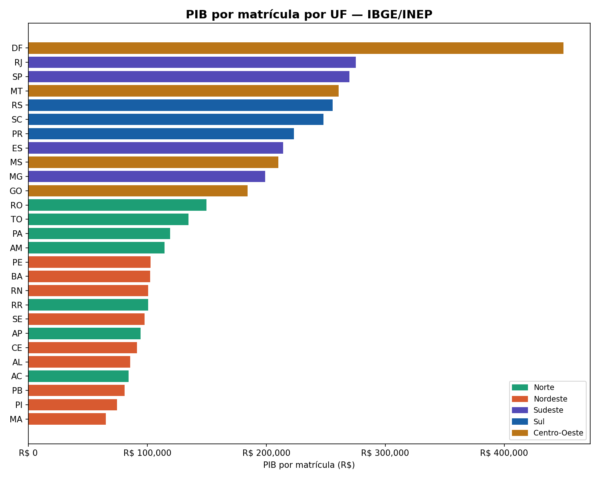
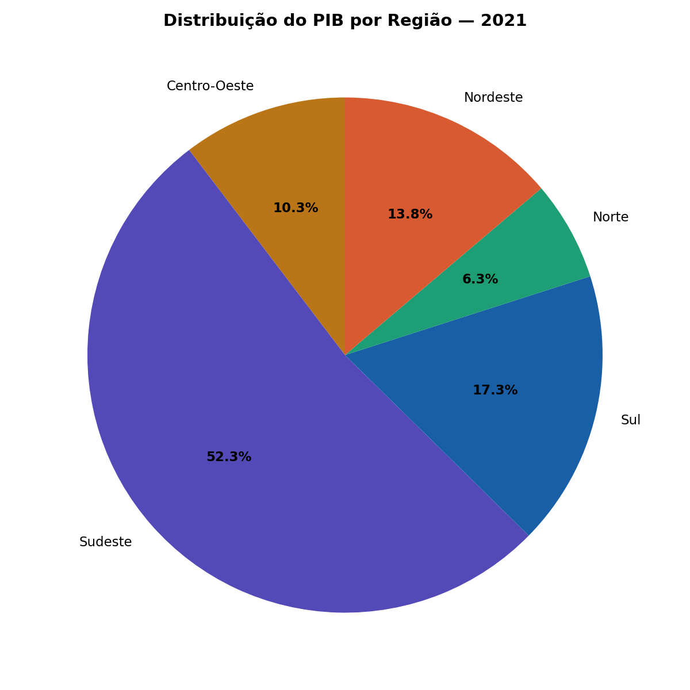
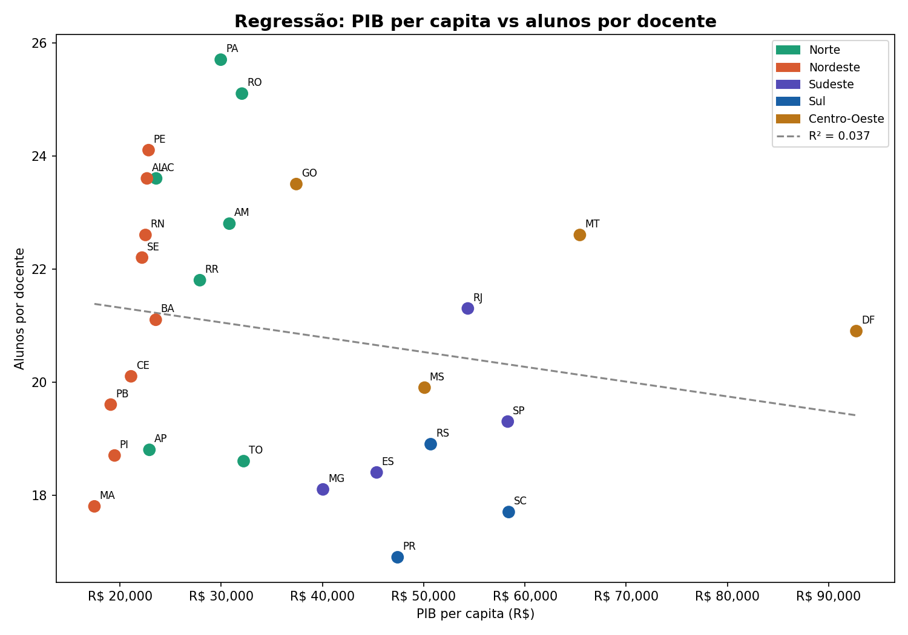
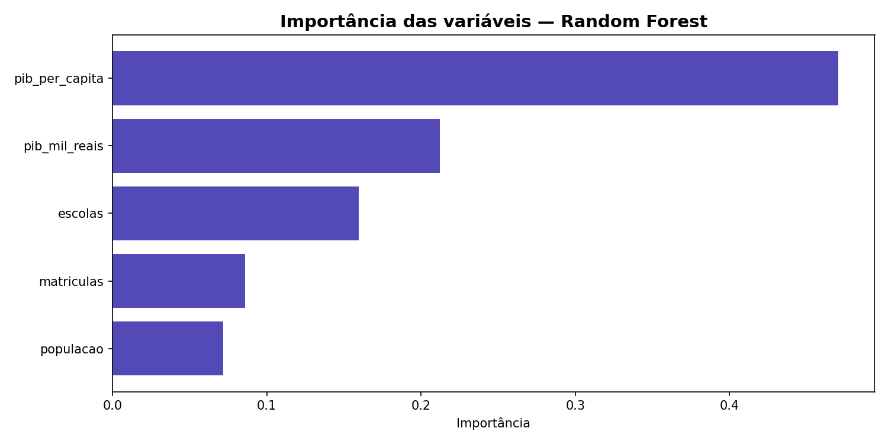
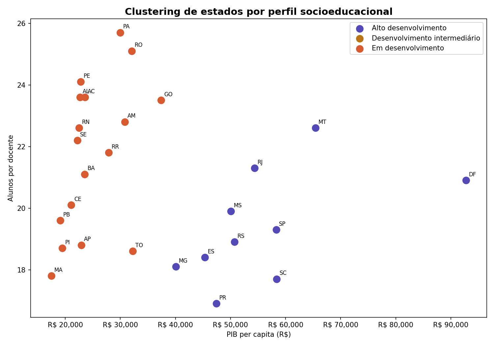

# Pipeline de Dados — Educação Pública no Brasil

Pipeline completa de engenharia e análise de dados sobre educação
pública brasileira, construída com ferramentas open source no Linux.

## Sobre o Projeto

Este projeto constrói uma pipeline end-to-end que coleta, armazena,
transforma, analisa e visualiza indicadores de educação pública no
Brasil — cruzando dados do IBGE e INEP com informações socioeconômicas.

**47 milhões de matrículas. 178 mil escolas. 2,3 milhões de docentes.**
Dados reais do Censo Escolar 2023 cruzados com PIB e população por UF.

### Principais achados

- O Pará tem **25,7 alunos por docente** — o maior do Brasil. Paraná tem 16,9.
- O DF tem **R$ 449 mil de PIB por matrícula**. Maranhão tem R$ 65 mil — 7x menos.
- O Nordeste concentra **27% da população** mas apenas **14% do PIB nacional**.
- O PIB per capita sozinho explica apenas **3,7%** da variação na razão alunos/docente (regressão linear) — mas um Random Forest com múltiplas variáveis explica **83,4%**.
- K-Means identificou **2 perfis socioeducacionais** claros: 10 estados de alto desenvolvimento e 17 em desenvolvimento.

## Visualizações

### PIB per capita por UF



### Alunos por docente por UF



### PIB por matrícula por UF



### Distribuição do PIB por região



### Regressão: PIB per capita vs alunos por docente



### Importância das variáveis (Random Forest)



### Clustering de estados por perfil socioeducacional



## Stack Técnico

| Camada | Ferramenta | Justificativa |
|--------|-----------|---------------|
| Linguagem | Python 3.12 | Ecossistema rico para dados |
| Ingestão | requests + openpyxl | API do IBGE + XLSX do INEP |
| Armazenamento | DuckDB | OLAP local, zero config, SQL moderno |
| Transformação | pandas + SQL | Flexibilidade entre código e queries |
| Visualização | matplotlib + plotly | Estático + interativo |
| Machine Learning | scikit-learn | Regressão, Random Forest, K-Means |
| Orquestração | Makefile + Python | Unix-native, transparente |
| Testes | pytest (27 testes) | Estrutura + qualidade de dados |
| Ambiente | Ubuntu Linux | Estável, open source, custo zero |

## Estrutura do Projeto

```
pipeline-educacao-brasil/
├── data/
│   ├── raw/                # Dados brutos (não versionados)
│   ├── processed/          # Dados limpos e transformados
│   ├── analytics/          # Tabelas analíticas finais
│   └── external/           # Datasets externos (INEP, não versionados)
├── src/
│   ├── ingestion/          # Scripts de coleta (IBGE + INEP)
│   ├── transformation/     # Limpeza e carga no DuckDB
│   ├── analysis/           # Tabelas analíticas e ML
│   └── visualization/      # Gráficos (matplotlib + plotly)
├── scripts/                # Orquestração da pipeline
├── tests/                  # Testes automatizados (27 testes)
├── docs/                   # Documentação e decisões técnicas
├── logs/                   # Logs de execução (não versionados)
├── outputs/                # Gráficos gerados
├── Makefile                # Orquestrador principal
├── requirements.txt        # Dependências Python
└── pyproject.toml          # Configuração do projeto
```

## Como Executar

```bash
git clone https://github.com/maurizioprizzi/pipeline-educacao-brasil.git
cd pipeline-educacao-brasil

# Setup completo
make setup

# Pipeline completa (ingestão → transformação → análise → visualização)
make run

# Executar etapas individuais
make ingest      # Baixar dados do IBGE
make transform   # Carregar no DuckDB
make analyze     # Gerar tabelas analíticas
make visualize   # Gerar gráficos

# Machine Learning
.venv/bin/python -m src.analysis.ml_models

# Rodar testes (27 testes)
make test

# Ver todos os comandos
make help
```

**Pré-requisitos:** Python 3.12+, Ubuntu/Debian, Make, Git.

Para os dados do INEP, baixe a Sinopse Estatística antes de rodar:
```bash
mkdir -p data/external
wget -O data/external/sinopse_2023.zip \
  "https://download.inep.gov.br/dados_abertos/sinopses_estatisticas/sinopses_estatisticas_censo_escolar_2023.zip"
unzip data/external/sinopse_2023.zip -d data/external/
```

## Evolução do Projeto

Cada dia de desenvolvimento está documentado na pasta `docs/` com as decisões técnicas.

| Dia | Etapa | Status |
|-----|-------|--------|
| 1 | Setup e estrutura | ✅ |
| 2 | Ingestão de dados (IBGE) | ✅ |
| 3 | Armazenamento (DuckDB) | ✅ |
| 4 | Tabelas analíticas e métricas derivadas | ✅ |
| 5 | Visualizações (matplotlib + plotly) | ✅ |
| 6 | Novas fontes de dados (INEP) | ✅ |
| 7 | Cruzamento IBGE + INEP no DuckDB | ✅ |
| 8 | Visualizações avançadas | ✅ |
| 9 | Testes de qualidade de dados | ✅ |
| 10 | Orquestração (pipeline completa, logging) | ✅ |
| 11 | Machine Learning (regressão, RF, clustering) | ✅ |
| 12 | Documentação final e README vitrine | ✅ |

## Fontes de Dados

- **IBGE** — População estimada e PIB por UF (API v3)
- **INEP** — Sinopse Estatística do Censo Escolar 2023 (matrículas, docentes, escolas)

## Autor

Maurizio Prizzi — [LinkedIn](https://www.linkedin.com/in/maurizioprizzi/) · [GitHub](https://github.com/maurizioprizzi)

## Licença

MIT